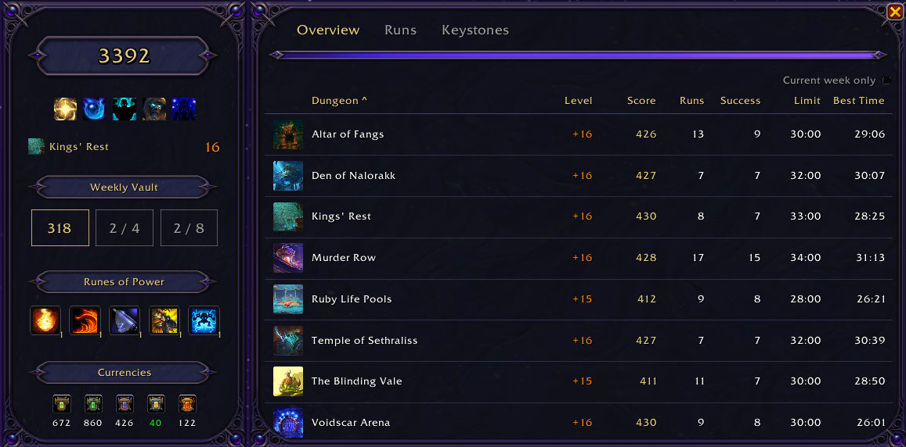
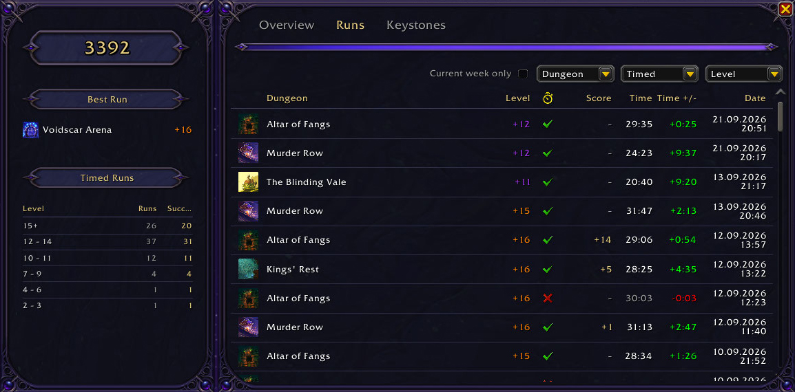
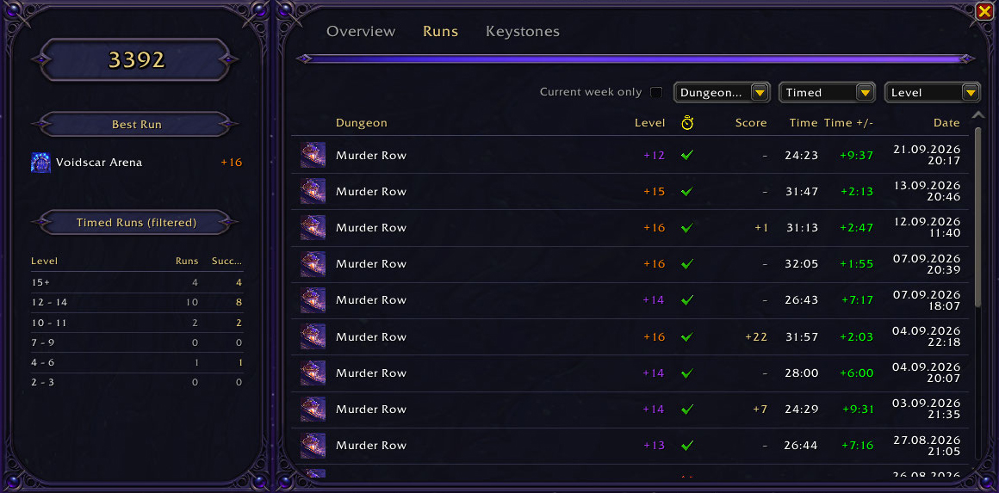
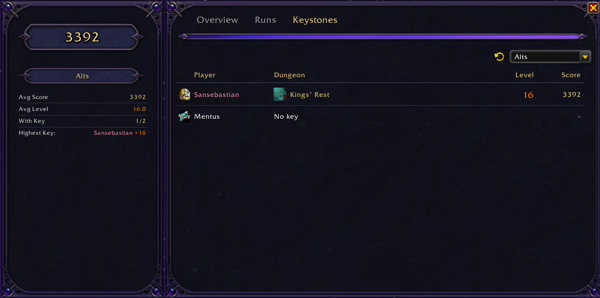
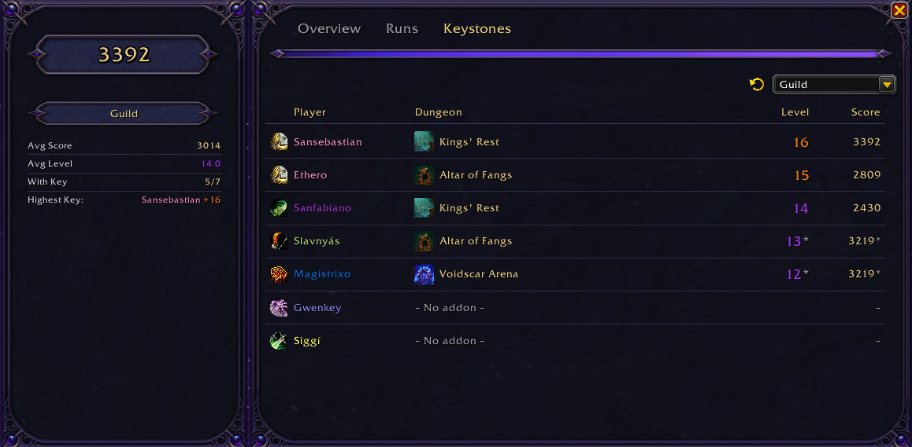
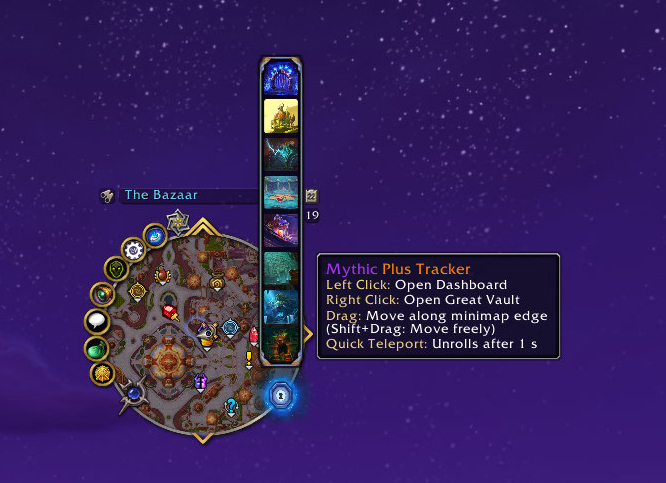
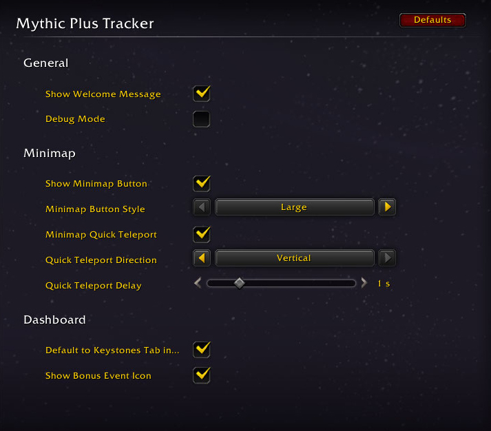

  
# Mythic Plus Tracker

A World of Warcraft retail addon that gives you a clear, at-a-glance overview of your Mythic+ (M+) / Mythic Plus progress — keystones, dungeons, score, group, and Weekly Vault — all in one compact UI.

## Features

### Dashboard
- 🗂️ **Overview** — sortable dungeon table for the season (level, score, runs, success, time limit, best time) with summary boxes for your highest keystone and your total/successful runs, a best-time delta tooltip, and a "Current week only" filter. Click a dungeon's icon to teleport there, or its name to open the Adventure Guide.
- 📜 **Runs** — full run history, color-coded by result, with a "Time +/-" column showing how far under or over the timer each run finished. Filter by dungeon, timed/not timed and keystone-level bracket, plus a "Current week only" checkbox.
- 🔑 **Keystones** — switch between Group, Alts, and Guild views via a dropdown; sortable columns (player, dungeon, level, score) with fallbacks for members missing a key or the addon. Click a group member's name for the player menu, a dungeon name for the Adventure Guide, or a dungeon icon in the Group view to teleport. A refresh button (Group, Guild) or a "last updated" info tooltip (Alts) shows how fresh the data is.
- 🎯 **Bonus Event** — during a Mythic dungeon bonus event week, an icon in the tab bar shows the *Emissary of War* quest state: still to do, ready to turn in, or done.

### Sidebar
The cards follow the active Dashboard tab; your M+ score sits on top of all three.

- 🏆 **M+ Score** — your overall score, color-coded by tier.
- ⚔️ **Affixes** — this week's active affixes, with tooltips. *(Overview)*
- 🗝️ **Keystone** — your current keystone, with the full item tooltip on hover. *(Overview)*
- 🗄️ **Weekly Vault** — reward previews and progress for all three vault slots, with the game's own reward tooltip; click a slot to open the Great Vault. *(Overview)*
- ✨ **Runes of Power** — Omnium Folio rune choices, with an interactive select/refund popup. *(Overview)*
- 💰 **Currencies** — your relevant Mythic+ currencies, highlighted when capped. *(Overview)*
- 📈 **Run Statistics** — your best run of the season (its name opens the Adventure Guide), plus a timed-run breakdown by key level that follows the Runs tab's filters. *(Runs)*
- 📊 **Statistics** — average score, average keystone level, how many currently hold a key, and the highest key — automatically follows whichever Keystones-tab mode (Group, Alts, or Guild) is selected. *(Keystones)*

### Minimap Button
- 🧭 A minimap button in a large or a compact style — drag it along the minimap edge (Shift+drag moves the large one freely), left-click opens the tracker, right-click opens the Great Vault.
- 🌀 **Quick Teleport** — hovering the button unrolls a strip of the season dungeons you own the "Path of ..." teleport for; click an icon to cast it. Unrolls sideways or vertically, after a delay you choose.

### Slash Commands
- ⌨️ Everything's available via `/mpt` (or `/mythicplustracker`) — `show`, `settings`, `announce`, `debug [on|off]`, `help`.
- 📢 `/mpt announce` — posts your current keystone to party, raid, or instance chat, as a clickable item link when possible.

### Group & Guild Communication
- 🔄 Keystone and score data syncs automatically between group/raid members running the addon — no manual action needed.
- 🏰 The same sync happens guild-wide over guild chat, covering every currently online guild member running the addon (shown in the Keystones tab's Guild view).
- 🔗 Members who don't run the addon still show up when another installed addon provides **LibKeystone** (DBM ships a copy). Those values carry a `*` and a tooltip naming the source and when it arrived — LibKeystone is optional and nothing is bundled.

### Settings
- ⚙️ Configure everything under **Options → AddOns → Mythic Plus Tracker** (or `/mpt settings`):
  - **General** — welcome message, debug mode.
  - **Minimap** — button visibility and style, quick teleport on/off, its direction and hover delay.
  - **Dashboard** — default to the Keystones tab while in a group, bonus event icon.
- 🐛 **Debug Mode** — prints additional diagnostic chat messages, useful for troubleshooting.

## Screenshots

<b>Dashboard</b>

The **Runs** tab lists every run of the season, color-coded by result, with a "Time +/-" column for how far under or over the timer it finished.

The filters drive the sidebar too — the timed-run breakdown turns into *Timed Runs (filtered)*.

The **Keystones** tab in its Alts view; the Statistics card follows whichever mode is selected.

The Guild view covers every online guild member. Values marked with `*` come from LibKeystone; members with neither show up as *– No addon –*.

<b>Minimap Button</b>

Hovering the button unrolls the Quick Teleport strip — here in its vertical direction.

<b>Settings</b>

Everything lives under **Options → AddOns → Mythic Plus Tracker**, or `/mpt settings`.

---

## Localization

MythicPlusTracker ships with full support for:

| | Locale | Language |
|---|--------|----------|
|  | `enUS` | English  |
|  | `deDE` | German   |
|  | `frFR` | French   |
|  | `esES` | Spanish  |
|  | `ruRU` | Russian  |

Want to add your language? See [CONTRIBUTING.md](CONTRIBUTING.md).

---

## Contributing

Contributions are welcome! Please read [CONTRIBUTING.md](CONTRIBUTING.md) for guidelines on submitting pull requests, reporting bugs, and adding translations.

---

## License

This project is licensed under [CC BY-NC-ND 4.0](https://creativecommons.org/licenses/by-nc-nd/4.0/) — see the [LICENSE](LICENSE) file for details. You may share this AddOn unmodified for free, with attribution, but not for commercial purposes or as a modified derivative. Pull requests to the official repository are always welcome.
